# Карта визуализаций магистерского диплома

Файл фиксирует, какие картинки подключены в `main.tex`, где лежат итоговые файлы и каким скриптом их пересобирать. Основная папка рисунков:

`overleaf-projects/masters-thesis/figures/`

## Быстрая регенерация

Из корня проекта диплома:

```bash
cd "/Users/elesingeorge/Desktop/Диплом Магистратура/overleaf-projects/masters-thesis"
python3 scripts/generate_physics_figures.py
```

Эта команда пересобирает `fig0_fuel_memory_concept`, `fig8_energy_partition`, `fig9_thermal_propagation` и `fig10_causal_structure` в форматах `.pdf` и `.png`.

Для улучшенной отдельной версии `fig8_energy_partition`:

```bash
cd "/Users/elesingeorge/Desktop/Диплом Магистратура/overleaf-projects/masters-thesis"
python3 scripts/make_fig8_energy_partition.py
```

Важно: `fig8_energy_partition` пишется двумя скриптами. Если нужен вариант из `make_fig8_energy_partition.py`, запускай его после `generate_physics_figures.py`.

Для GeN-Foam-рисунков:

```bash
python3 "/Users/elesingeorge/Desktop/Диплом Магистратура/openfoam-genfoam/geNfoam-nuclear/make_visualizations.py"
```

Эта команда пишет исходные PNG в `openfoam-genfoam/geNfoam-nuclear/visualizations/`, затем копирует нужные файлы в `overleaf-projects/masters-thesis/figures/` как `fig4`, `fig5`, `fig6` и обновляет `genfoam_regime_metrics.tex`.

## Сводная карта

| Рисунок в дипломе | Итоговый файл | Где подключён | Скрипт / функция | Что править |
|---|---|---|---|---|
| `fig:fuelMemoryConcept` | `figures/fig0_fuel_memory_concept.pdf`, `figures/fig0_fuel_memory_concept.png` | `main.tex:144` | `scripts/generate_physics_figures.py`, `make_fig0_fuel_memory_concept()` | Концепт памяти твэла, история `P(s)`, температурный след, ядра `K_D` и `H_fw`. |
| `fig:twoChannel` | `figures/fig1_twoChannel.pdf`, `figures/fig1_twoChannel.png` | `main.tex:151` | исходный `.py` не найден в проекте | Файл создан Matplotlib 3.10.8, но скрипт генерации отсутствует. Для правки лучше восстановить или заново написать отдельный скрипт. |
| `fig:doppler` | `figures/fig2_doppler.pdf`, `figures/fig2_doppler.png` | `main.tex:242` | исходный `.py` не найден в проекте | Файл создан Matplotlib 3.10.8, но скрипт генерации отсутствует. |
| `fig:dynamics` | `figures/fig3_dynamics.pdf`, `figures/fig3_dynamics.png` | `main.tex:358` | исходный `.py` не найден в проекте | Файл создан Matplotlib 3.10.8, но скрипт генерации отсутствует. |
| `fig:genfoamBaselineSubtracted` | `figures/fig4_genfoam_baseline_subtracted.png` | `main.tex:881` | `openfoam-genfoam/geNfoam-nuclear/make_visualizations.py`, `plot_baseline_subtracted()` | Временные ряды `pulse - baseline`: мощность, реактивность, температуры, proxy теплового потока. |
| `fig:genfoamPerturbationMaps` | `figures/fig5_genfoam_perturbation_maps.png` | `main.tex:892` | `openfoam-genfoam/geNfoam-nuclear/make_visualizations.py`, `plot_perturbation_maps()` | Карты возмущений `Delta T`, `Delta TFuel`, `Delta powerDensity`, `Delta heatFlux.structure`. |
| `fig:genfoamRegimeDiagnostics` | `figures/fig6_genfoam_regime_diagnostics.png` | `main.tex:909` | `openfoam-genfoam/geNfoam-nuclear/make_visualizations.py`, `plot_regime_diagnostics()` | Диагностика режима, сравнение GeN-Foam proxy с reduced target regime. |
| `tab:genfoamRegimeMetrics` | `figures/genfoam_regime_metrics.tex` | `main.tex:914` | `openfoam-genfoam/geNfoam-nuclear/make_visualizations.py`, `write_metrics()` и `write_thesis_metrics_table()` | Таблица численных критериев режима. Обновляется вместе с GeN-Foam-визуализациями. |
| `fig:causalStructure` | `figures/fig10_causal_structure.pdf`, `figures/fig10_causal_structure.png` | `main.tex:940` | `scripts/generate_physics_figures.py`, `make_fig10_causal_structure()` | Причинно-следственная схема от мощности к доплеровской обратной связи и теплу в воде. |
| `fig:fuelPinAnatomy` | `figures/fig7_fuel_pin_anatomy.pdf`, `figures/fig7_fuel_pin_anatomy.png` | `main.tex:947` | исходный `.py` не найден в проекте | Файл создан Matplotlib 3.10.8, но скрипт генерации отсутствует. |
| `fig:energyPartition` | `figures/fig8_energy_partition.pdf`, `figures/fig8_energy_partition.png` | `main.tex:956` | `scripts/generate_physics_figures.py`, `make_fig8_energy_partition()`; альтернативно `scripts/make_fig8_energy_partition.py` | Распределение энергии деления. Осторожно: два скрипта пишут один и тот же файл. |
| `fig:thermalPropagationOverview` | `figures/fig9_thermal_propagation.pdf`, `figures/fig9_thermal_propagation.png` | `main.tex:965` | `scripts/generate_physics_figures.py`, `make_fig9_thermal_propagation()` | Тепловая диффузия, задержка воды, сравнение `K_D(t)` и `H_fw(t)`. |
| `fig:thermalRadialRelaxation` | `figures/fig14_thermal_radial_relaxation.pdf`, `figures/fig14_thermal_radial_relaxation.png` | `main.tex:1262` | `scripts/make_fig_thermal_radial_relaxation.py` | Численное решение радиального уравнения теплопроводности в твэле (UO2 + He gap + Zr) после импульса мощности. (а) профили `ΔT_f(r,t)` с метками `√(α_f t)`; (б) разделение энергии между топливом, оболочкой и водой в log-времени, окна `K_D` и `H_fw`. |

## Источники данных для GeN-Foam

`make_visualizations.py` использует:

- `openfoam-genfoam/geNfoam-nuclear/baselinePulse-results/genfoam_pointkinetics_timeseries.csv`
- `openfoam-genfoam/geNfoam-nuclear/diplomaPulse/`
- `openfoam-genfoam/geNfoam-nuclear/diplomaBaseline/`
- `openfoam-genfoam/reduced-model/results/two_channel_memory.csv`

Итоговые рабочие файлы GeN-Foam:

- `openfoam-genfoam/geNfoam-nuclear/visualizations/diplomaPulse_baseline_subtracted_ms.png` -> `figures/fig4_genfoam_baseline_subtracted.png`
- `openfoam-genfoam/geNfoam-nuclear/visualizations/diplomaPulse_perturbation_maps.png` -> `figures/fig5_genfoam_perturbation_maps.png`
- `openfoam-genfoam/geNfoam-nuclear/visualizations/diplomaPulse_regime_diagnostics.png` -> `figures/fig6_genfoam_regime_diagnostics.png`
- `openfoam-genfoam/geNfoam-nuclear/visualizations/diplomaPulse_regime_metrics.json` -> `figures/genfoam_regime_metrics.tex`

## Файлы без найденного исходного скрипта

У следующих визуализаций есть готовые `.pdf` и `.png`, но нет найденного `.py`-скрипта в текущем проекте:

- `fig1_twoChannel`
- `fig2_doppler`
- `fig3_dynamics`
- `fig7_fuel_pin_anatomy`

По метаданным PDF они тоже сгенерированы Matplotlib 3.10.8. Если их нужно часто править, лучше вынести каждую в отдельный скрипт в `scripts/` или добавить функции в `generate_physics_figures.py`.

## Проверка подключённых рисунков

Чтобы быстро увидеть все подключения в LaTeX:

```bash
cd "/Users/elesingeorge/Desktop/Диплом Магистратура/overleaf-projects/masters-thesis"
rg -n -F -e "\\includegraphics" -e "\\input{figures/genfoam_regime_metrics.tex}" main.tex
```

Чтобы проверить, какие изображения лежат в `figures/`:

```bash
cd "/Users/elesingeorge/Desktop/Диплом Магистратура/overleaf-projects/masters-thesis"
find figures -maxdepth 1 -type f \( -name "*.png" -o -name "*.pdf" -o -name "*.tex" \) -print | sort
```

## Превью PNG

### fig0_fuel_memory_concept

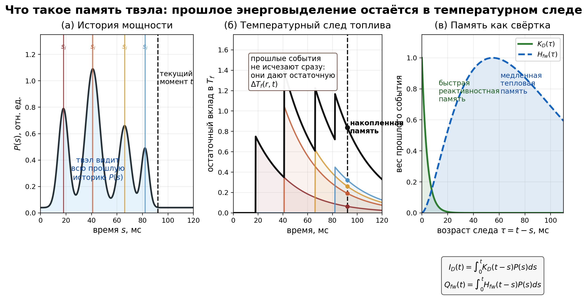

### fig1_twoChannel

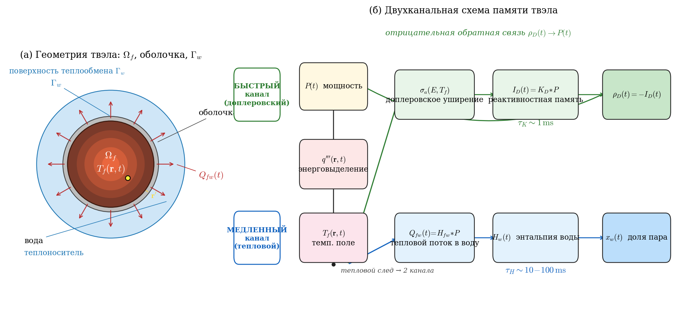

### fig2_doppler

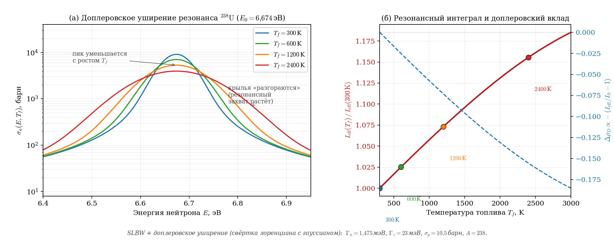

### fig3_dynamics

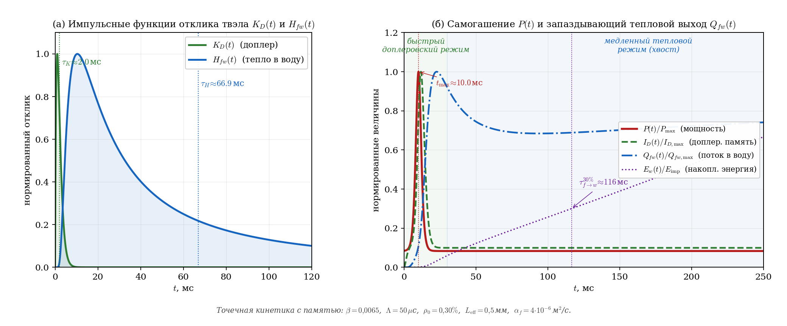

### fig4_genfoam_baseline_subtracted

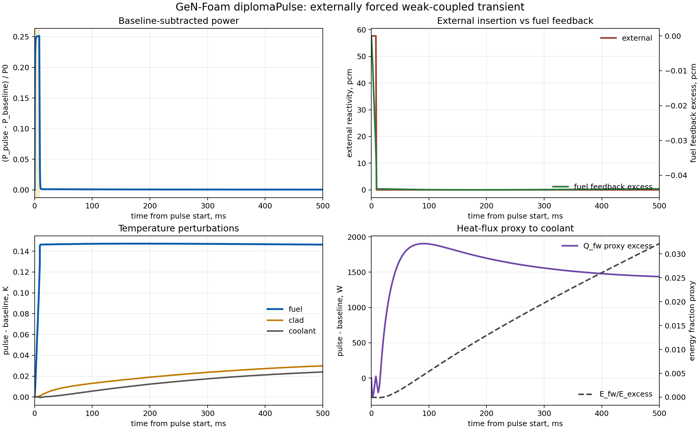

### fig5_genfoam_perturbation_maps

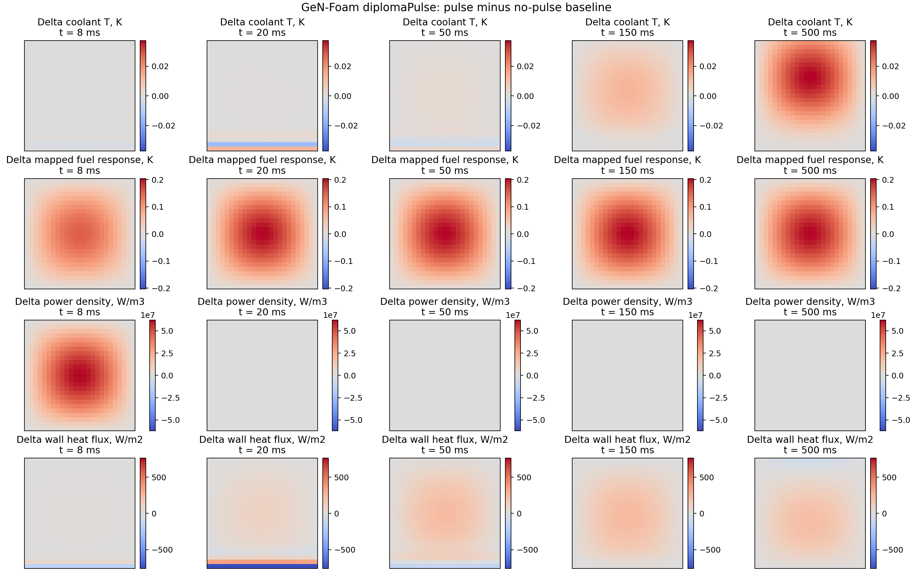

### fig6_genfoam_regime_diagnostics

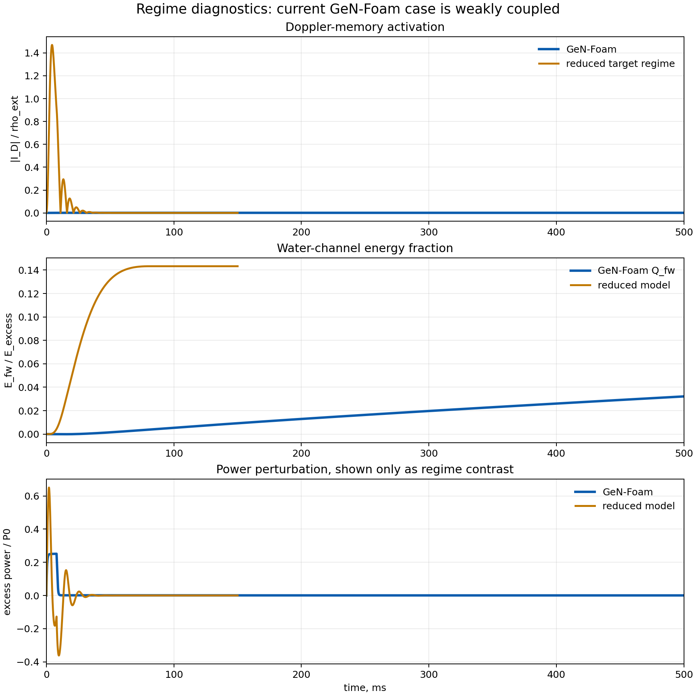

### fig7_fuel_pin_anatomy

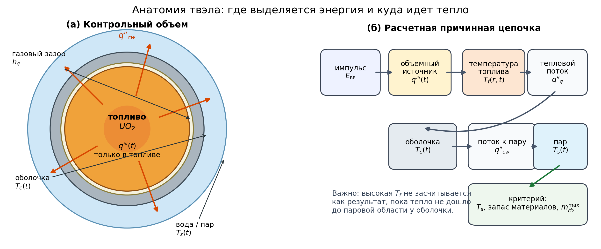

### fig8_energy_partition

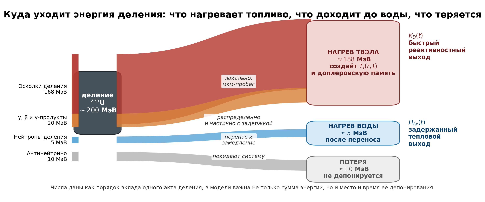

### fig9_thermal_propagation

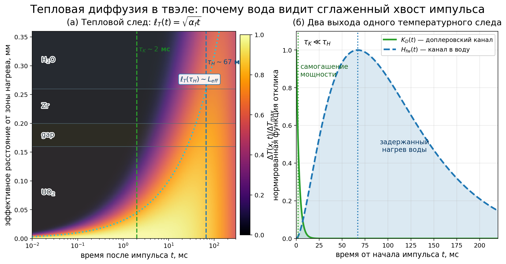

### fig10_causal_structure

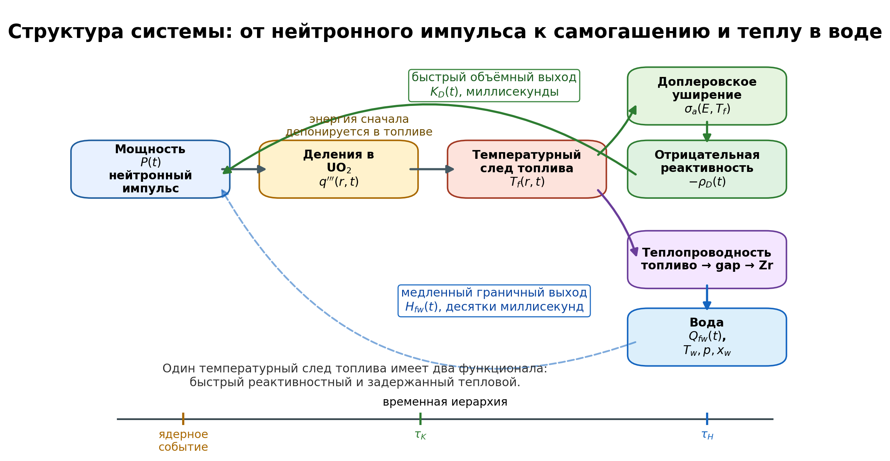
